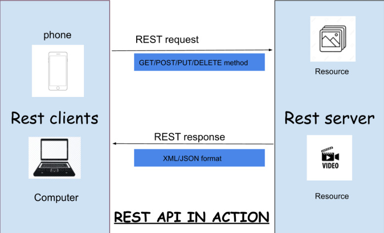
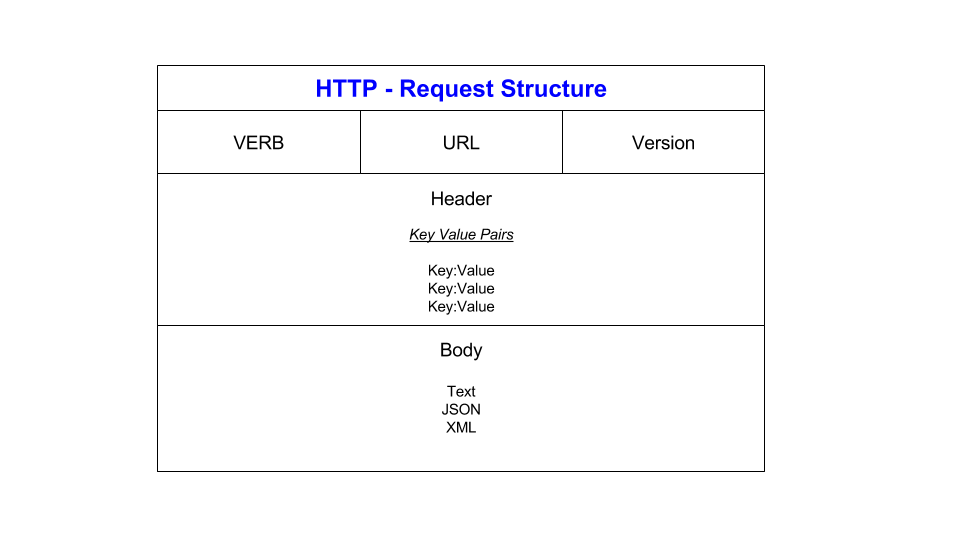
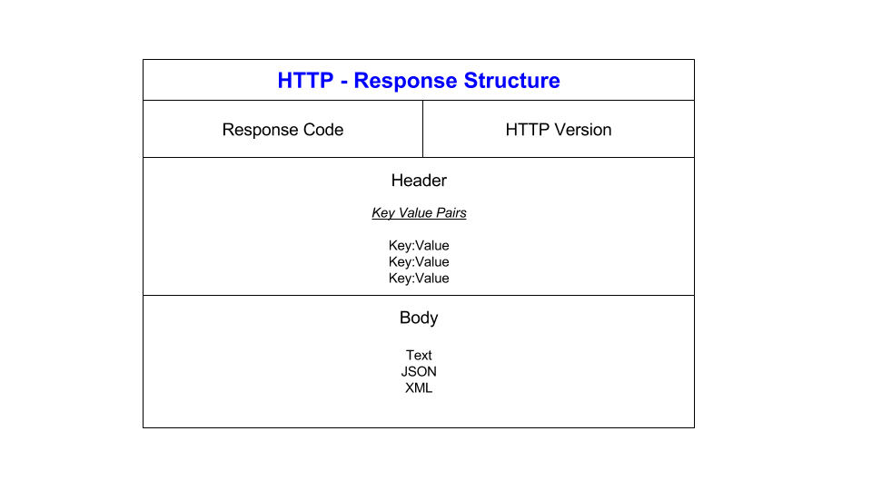

# What are API's? 

APIs are mechanisms that enable two software components to communicate with each other using a set of definitions and protocols. For example, the weather bureau’s software system contains daily weather data. The weather app on your phone “talks” to this system via APIs and shows you daily weather updates on your phone.

API stands for Application Programming Interface. In the context of APIs, the word Application refers to any software with a distinct function. Interface can be thought of as a contract of service between two applications. This contract defines how the two communicate with each other using requests and responses. Their API documentation contains information on how developers are to structure those requests and responses.

## How do API's work?

API architecture is usually explained in terms of client and server. The application sending the request is called the client, and the application sending the response is called the server. So in the weather example, the bureau’s weather database is the server, and the mobile app is the client. 

There are four different ways that APIs can work depending on when and why they were created.

* **SOAP APIs** : 
These APIs use Simple Object Access Protocol. Client and server exchange messages using XML. This is a less flexible API that was more popular in the past.

  
* **RPC APIs** : 
These APIs are called Remote Procedure Calls. The client completes a function (or procedure) on the server, and the server sends the output back to the client.

* **Websocket APIs** : 
Websocket API is another modern web API development that uses JSON objects to pass data. A WebSocket API supports two-way communication between client apps and the server. The server can send callback messages to connected clients, making it more efficient than REST API.

* **REST APIs** :
These are the most popular and flexible APIs found on the web today. The client sends requests to the server as data. The server uses this client input to start internal functions and returns output data back to the client. Let’s look at REST APIs in more detail below.

APIs are surprisingly significant in the current world as they dictate how software developers create new applications that utilize web services like Facebook, Google Maps, and many more. APIs are also great time savers. They offer a tremendous level of accessibility in many ways.

## What is a REST API?

A REST API (Representational State Transfer Application Programming Interface) is a type of API that follows the principles of REST architecture. REST is an architectural style for designing networked applications. RESTful APIs adhere to these principles, making them easy to use, scalable, and interoperable with other systems.

Here are the key principles that make an API RESTful:
* **Client-Server Architecture** : The client and server are separate entities, each with its concerns. Clients are not concerned with data storage, while servers are not concerned with user interfaces.

* **Statelessness**: Each request from a client to the server must contain all the necessary information to understand the request. The server should not store any client context between requests. This simplifies the server implementation and improves scalability.

* **Manipulation of Resources Through Representations** : Clients interact with resources by exchanging representations of the resource's state. For example, using HTTP methods like GET, POST, PUT, DELETE to perform CRUD operations (Create, Read, Update, Delete) on resources.

 
Example of a REST API in action : 
  

 
As for REST API guidelines, they often include best practices for designing APIs that adhere to REST principles, here are a few below :

* Use nouns to represent resources (e.g., /users for a collection of users).
* Use HTTP methods (GET, POST, PUT, DELETE) to perform CRUD operations on resources.
* Version your API to allow for changes without breaking existing clients (e.g., /v1/users).
* Document your API thoroughly, including endpoints, request and response formats, and authentication methods.
* Use security measures like HTTPS and authentication mechanisms to protect your API from unauthorized access.

## What is HTTP... and how is it different to HTTPS?

 

**The Hypertext Transfer Protocol (HTTP)** is the foundation of the World Wide Web, and is used to load webpages using hypertext links. HTTP is an application layer protocol designed to transfer information between networked devices and runs on top of other layers of the network protocol stack. A typical flow over HTTP involves a client machine making a request to a server, which then sends a response message.

**Hypertext transfer protocol secure (HTTPS)** is the secure version of HTTP, which is the primary protocol used to send data between a web browser and a website. HTTPS is encrypted in order to increase security of data transfer. This is particularly important when users transmit sensitive data, such as by logging into a bank account, email service, or health insurance provider.

There is a structure for both the request and response of **HTTP** : 

- **Request Line** : The request line contains three parts: the HTTP method, the requested resource (URI), and the HTTP version.
- **Headers** : HTTP headers provide additional information about the request or the client itself. Headers include metadata such as content type, content length, authentication credentials, and more.
- **Empty Line**: An empty line indicates the end of the header section and separates headers from the optional message body.
- **Message Body**: In some types of HTTP requests, such as POST or PUT requests, key-value pairs can be included within the message body. This is common when sending data to a server, such as form submissions or JSON payloads. For example, in a POST request with form data, the key-value pairs would typically be encoded using the "application/x-www-form-urlencoded" format:

- **Status Line** : Similar to the request line, the status line in the response contains three parts: the HTTP version, the status code, and a reason phrase.
Example: HTTP/1.1 200 OK
- **Headers** : Like in requests, response headers provide additional information about the response or the server itself. Headers include metadata such as content type, content length, server details, and more.
- **Empty Line**: Similar to the request, an empty line separates headers from the message body.
- **Message Body**: The message body contains the actual content of the response, such as HTML for web pages, JSON data, images, etc. The presence and format of the message body depend on the request type and headers.

## What are the 5 HTTP verbs? And what does each do? ##
 
The five most commonly used HTTP methods, or verbs, are:

* **GET**: The GET method requests a representation of the specified resource. It is used to retrieve data from the server. GET requests should only retrieve data and should not have any other effect on the server's state.
* **POST**: The POST method is used to submit data to be processed to the specified resource. It often results in the creation of a new resource on the server. POST requests can be used for various purposes, such as submitting form data, uploading files, or creating new records in a database.
* **PUT**: The PUT method is used to update the resource at the specified URL with the new data provided in the request payload. It replaces the entire resource with the new data. If the resource does not exist, PUT can create a new resource with the provided data.
* **DELETE**: The DELETE method is used to remove the specified resource from the server. It deletes the resource identified by the URL. DELETE requests are irreversible, meaning they permanently remove the resource from the server.

These HTTP methods provide a standardized way for clients to interact with resources on the server, enabling CRUD (Create, Read, Update, Delete) operations and other actions.

## What is stateless?

Statelessness in the context of HTTP means that the server does not maintain any client context between requests. Each request from a client to the server is independent and self-contained, and the server does not rely on any information from previous requests when processing a new request. This design principle simplifies server implementation, improves scalability, and enables better fault tolerance.

Examples of Stateless HTTP Requests : 
* **GET Request for a Web Page** : When a client requests a web page using a GET request, the server responds with the requested page. Each GET request is independent, and the server does not need to maintain any client state between requests.
* **GET Request for an API Endpoint** : Similarly, when a client makes a GET request to retrieve data from an API endpoint, the server processes the request based solely on the information provided in that request. There is no need for the server to remember previous requests from the same client.

Examples of Stateful HTTP Requests:
* **Login and Session Management**: When a user logs into a web application, the server typically creates a session for that user and stores session information (e.g., user authentication token) on the server. Subsequent requests from the same client may rely on this session information to authenticate the user and provide personalized content.
* **Multi-step Workflows** : Some applications involve multi-step workflows where the state of the process is carried forward between requests. For example, in a multi-step form submission, the server needs to maintain the state of the form across multiple requests until the user completes the entire process.

In stateful requests, the server relies on information stored from previous interactions with the client to process subsequent requests, whereas in stateless requests, each request is independent and self-contained.

## What is caching?

Caching is a technique used to store copies of frequently accessed or computed data in a temporary storage location called a cache. The purpose of caching is to speed up access to data by reducing the need to fetch it from the original source every time it is requested.

Here's how caching works:
* **Data Retrieval** : When a client requests data from a server, the server retrieves the data from its original source, such as a database, file system, or external API.
* **Caching** : After retrieving the data, the server stores a copy of it in a cache. The cache can be located either on the server itself, on an intermediary device (like a proxy server or a content delivery network), or even on the client side (like in web browsers).
* **Subsequent Requests**: If the same data is requested again in the future, instead of fetching it from the original source, the server checks the cache first. If the data is found in the cache and is still valid (i.e., not expired), the server returns the cached copy to the client without having to retrieve it again from the original source.

Key benefits of caching include:
* **Faster Response Times**: Cached data can be served to clients more quickly than data fetched from the original source, leading to faster response times and improved user experience.
* **Reduced Server Load** : By serving cached data instead of fetching it from the original source, caching reduces the load on servers, databases, and other backend systems, thereby improving overall system scalability and performance.
* **Improved Scalability** : Caching helps distribute the workload more efficiently across servers and reduces the need for additional resources to handle high traffic volumes.

